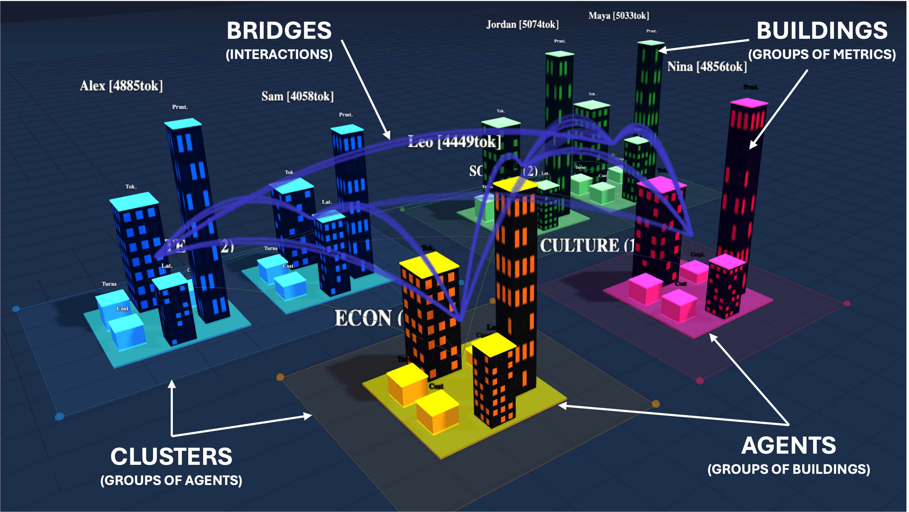
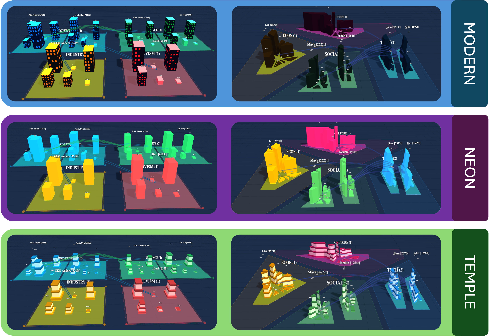

# LLMAgentCity — Rethinking the City Metaphor for LLM Agent Societies

Spatial visualization framework for multi-agent LLM conversations. Maps agent behavior across four analytical dimensions — **Social**, **Affective**, **Operational**, **Coordination** — onto interactive 3D city layouts with Grid and Voronoi tessellation.



---

## Features

- **4 analytical bundles** with 5 building archetypes each (20 buildings per agent), using multi-channel geometric encoding (height, width, depth, color)
- **Grid and Voronoi layouts** as complementary spatial logics — Grid for comparison, Voronoi for territorial differentiation
- **Interactive timeline scrubber** through full simulation history with per-snapshot state replay
- **Real-time emotion detection** via NRC Emotion Lexicon (14,182 words, 8 basic emotions) and keyword-based sentiment analysis
- **55+ computable metrics** across social network, affective, operational, and coordination dimensions
- **LLM-powered simulation** with Ollama (local or cloud) and any OpenAI-compatible provider
- **Multi-district conversations** simulating separate discussion groups with cross-district communication
- **Generate Report** button that sends conversation data to a configurable LLM for automated academic-style analysis
- **Multiple simulation modes**: Conversation, Debate, and Developer



---

## Requirements

- Python 3.8+
- Web browser with WebGL 2.0 support
- Optional: Ollama (local), or any OpenAI-compatible API endpoint

## dependencies

```bash
pip install fastapi uvicorn requests networkx
```

The project also uses the following CDN-libraries (loaded in the browser):
- Three.js r128 — 3D rendering
- D3-Delaunay v6 — Voronoi tessellation
- OrbitControls — camera navigation

---

## Quick Start

```bash
# Start the server
python3 -m uvicorn src.server.main:app --net 0.0.0.0 --port 8002

# Open in browser
# http://localhost:8002
```

### Configure an Ellem

1. Go to the **Settings** tab in the sidebar
2. Enter your LLM endpoint URL:
   - Local Ollama: `http://localhost:11434` (no API key needed)
   - Cloud Ollama: `https://api.ollama.com` (requires API key)
   - Any OpenAI-compatible: your provider's URL
3. Click **Load Models** and select one
4. Load a preset from the **Sim** panel
5. Run simulation rounds

---

## City Views

### Social
Network structure and relational prominence. Buildings encode betweenness, reciprocity, clustering, brokerage, and influence.

### Affective
Emotional dynamics via the PAD model (Pleasure-Arousal-Dominance). Buildings encode arousal, volatility, sentiment, emotional influence, and persistence.

### Operational
Constructional footprint — token usage, latency, cost. Buildings encode cost, latency, context utilization, reliability, and efficiency.

### Coordination
Collective reasoning — planning,delegation, consensus, argumentation. Buildings encode argument strength, participation equity, leadership, and alignment.

---

## Generate Report

After running a simulation:

1. Go to the **Analysis** tab
2. Click **Generater Report (LLM)**
3. The active LM analyzes all agent metrics and conversation logs
4. A structured report appears with: Executive Summary, Participation Overview, Social Network Analysis, Affective Analysis, Operational Analysis, Coordination Analysis, Key Insights, and Methodology Notes
5. Click **Download Report** to save as `.md`

---

## API Endpoints

| Method | Path | Description |
|--------|------|-------------|
| GET | `/api/state` | Full simulation state |
| GET | `/api/timeline` | Complete message timeline |
| GET | `/api/snapshots` | All snapshots |
| GET | `/api/snapshot/{n}` | Snapshot at index |
| POST | `/api/preset/load` | Load a simulation preset |
| POST | `/api/simulate/round` | Run one conversation round |
| POST | `/api/simulate/broadcast` | Group round (all agents respond) |
| POST | `/api/simulate/debate` | Debate of the round |
| POST | `/api/simulate/developer` | Development of the round |
| POST | `/api/simulate/multi-round` | Run N rounds |
| POST | `/api/simulate/multi-district` | Multiple districts simulation |
| POST | `/api/agent/add` | Add new agent |
| DELETE | `/api/agent/{aid}` | Remove agent |
| POST | `/api/clusters` | Set cluster config |
| POST | `/api/clusters/add` | Add cluster |
| POST | `/api/cluster/auto-arrange` | Auto-layout clusters |
| GET | `/api/config` | Get configuration |
| POST | `/api/config` | Update configuration |
| GET | `/api/models` | List available LLM models |
| GET | `/api/analytics/export` | Export full analytics JSON |
| GET | `/api/problem/export` | Export problem configuration |
| GET | `/api/results/export` | Export play simulation results |
| POST | `/api/results/load` | Replay saved results |
| POST | `/report/generate` | Generate LLM-powered analysis report |
| POST | `/api/reset` | Reset entire simulation |
| GET | `/api/metrics/status/{agent_id}` | Agent metrics status |

---

## Preheat Included

| Preset | Mode | Agents |
|--------|------|--------|
| Urban Sustainability Council | conversation | 6 |
| AI Regulation Debate | debate | 5 |
| Climate Summit | debate | 6 |
| Moderate Decision | conversation | 6 |
| Energy Transition | debate | 8 |
| Small Dev Team | developer | 3 |
| Academic Conference | conversation | 8 |
| Cybersecurity War Room | debate | 6 |
| Neuroscience Workshop | conversation | 9 |
| Joint Military Command | conversation | 6 |
| Diplomatic Negotiation | conversation | 8 |

---

## Architecture

```
LLMAgentCity/
├── src/
│   ├── server/
│   │   ├── main.py                  # FastAPI application (2,940 lines)
│   │   ├── config.py                # Configuration constants
│   │   ├── emotion_engine.py        # NRC/CodEmotion lexicons loader
│   │   ├── metrics/
│   │   │   ├── social.py            # Social network metrics (14 functions)
│   │   │   ├── affective.py         # Affective metrics (14 functions)
│   │   │   ├── operational.py       # Operational metrics (16 functions)
│   │   │   ├── conversation.py      # Speech acts, lexical diversity
│   │   │   ├── debate.py            # Stance, consensus, coordination (22 functions)
│   │   │   ├── developer.py         # Task phases, file coordination
│   │   │   ├── normalization.py     # EMA smoothing + percentile normalization
│   │   │   └── integration.py       # Metrics lifecycle management
│   │   └── analytics/
│   │       └── metrics_engine.py    # Unified metrics computation orchestration
│   └── frontend/
│       ├── index.html               # Single-page 3D visualization (5,040 lines)
│       └── js/
│           ├── voronoi_system.js    # Voronoi + containment + polygon generator
│           ├── area_manager.js      # Area calculation utilities
│           └── area_validator.js    # Spatial hierarchy validation
├── data/
│   └── lexicon/
│       ├── NRC-emotion-lexicon-wordlevel-alphabetized-v0.92.txt
│       ├── vad_lexicon.csv
│       └── external/
├── tests/
│   ├── test_metrics.py              # 43 unit tests for all metric modules
│   ├── test_api.py
│   ├── test_area_consistency.html
│   └── test_containment.html
├── img/
│   ├── agentcity_parts.png
│   └── style_agentcity.png
└── README.md
```

---

## Testing

```bash
pytest tests/test_metrics.py -v
```

Covers all metric modules (social, affective, operational, conversation, developer, debate, integration).

---

## Metrics Catalog

### Paper-aligned normalizedization pipeline

Following the included paper (`elsarticle-template-num.tex`), the normalization follows three strategies:

1. **Identity** — for metrics already in `[0,1]`
2. **Affine** — `φ(x) = (x+1)/2` for `[-1,1]` ranges (valence, stance)
3. **Population-relative log** — `φ(x) = log(x / median + 1) / log(max / median + 1)` for heavyweight distributions (tokens, cost, latency)

---

## Research Context

This tool implements the adaptive city-metaphor framework for LLM agents described in the article *"Rethinking the city metaphor for large language model agent societies"*. The city is not a fixed one-shot visualization but a reusable analytical environment where the same agent population can be revisited under different views.

---

## Citation

Pending publication. Contact: antoniojose.romero@uah.es

---

## License

This project is academic research software. See the accompanying paper for terms of use.
